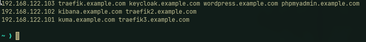

Mettre en place les certificats SSL pour les différents services en utilisant Traefik comme reverse proxy.
Si vous utilisez Firefox, vous pouvez ajouter les certificats SSL générés par Traefik à la liste des certificats de confiance de votre navigateur pour éviter les avertissements de sécurité.
Copier les .env.example dans des fichiers .env respectifs et les remplir avec les valeurs appropriées.

docker compose \
 -f rocky1/traefik/docker-compose.yml \
 -f rocky1/uptime-kuma/docker-compose.yml \
 -f rocky2/elk/docker-compose.yml \
 -f rocky2/traefik/docker-compose.yml \
 -f rocky3/traefik/docker-compose.yml \
 -f rocky3/wordpress/docker-compose.yml \
 -f rocky3/keycloak/docker-compose.yml \
 -f rocky3/filebeat/docker-compose.yml \

Modifier si vous le souhaitez les différents domaines utilisés pour correspondre à votre configuration
Modifier le /etc/hosts pour ajouter les différents domaines utilisés dans les applications
Exemple:

